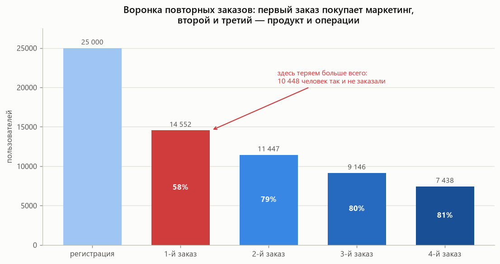
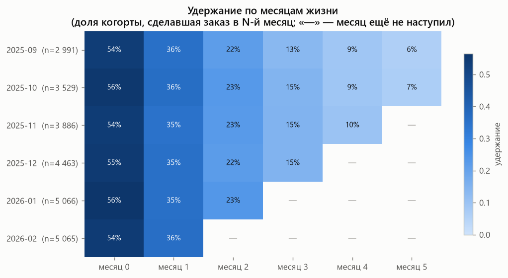
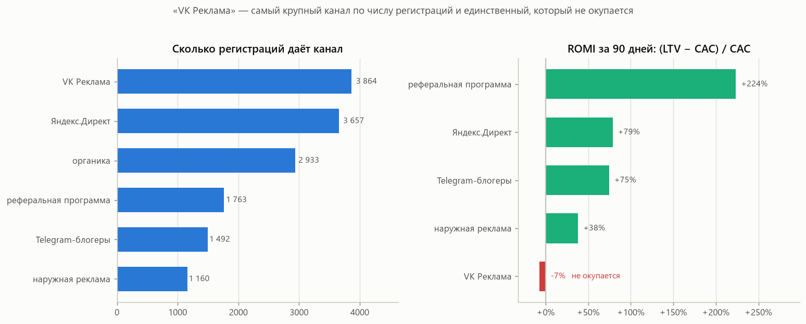
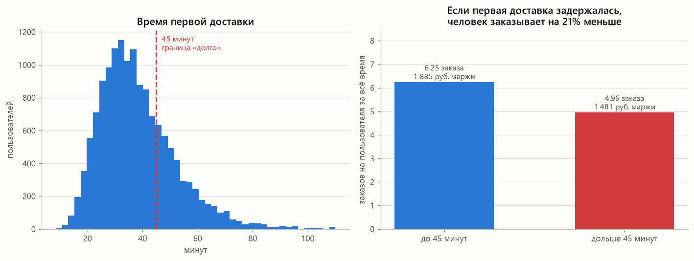
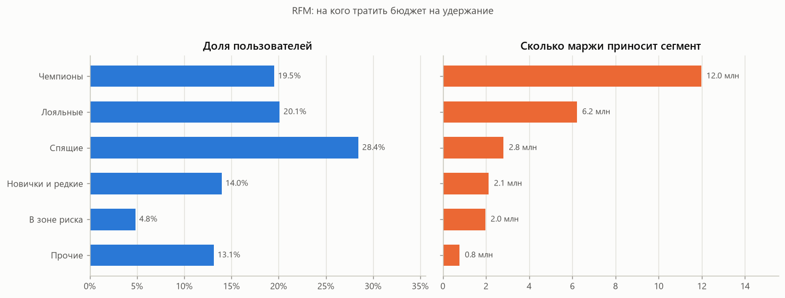
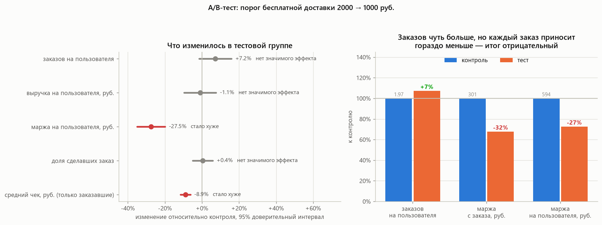

# Продуктовая аналитика сервиса доставки продуктов

Учебный проект от сырых данных до решений, которые можно нести на продуктовый комитет. Сервис доставки «Полка» вымышленный, данные синтетические, но задачи и ошибки в них настоящие.

Внутри: SQL, pandas, статистика A/B-тестов, юнит-экономика каналов привлечения и графики. Запускается одной командой.

**Если не знаете, с чего начать - откройте [ОБЪЯСНЕНИЕ.md](ОБЪЯСНЕНИЕ.md).** Там разобрано, чем занимается продуктовый аналитик, как устроен проект и что означает каждая метрика.

---

## Три вывода, ради которых всё считалось

### 1. VK Реклама не окупается - и это самый крупный канал

VK даёт самую дешёвую регистрацию из платных каналов (420 ₽), поэтому по отчёту «сколько привели пользователей» он выглядит лучшим. Но до первого заказа доходит 41 % против 60–69 % у остальных. За 90 дней такой пользователь приносит 390 ₽ маржи при цене привлечения 420 ₽. Канал работает в минус.

Что предлагаю: срезать бюджет VK вдвое (около 1,36 млн ₽) и перелить в Яндекс.Директ. При том же бюджете получится примерно 2 200 пользователей вместо 3 240, но маржи они принесут около 2,4 млн ₽ вместо 1,3 млн - плюс порядка 1,1 млн ₽. Важно: расчёт предполагает, что Яндекс.Директ примет дополнительный объём без роста CAC. Проверять надо постепенным переливом.

Для сравнения: реферальная программа даёт ROMI +224 %, Яндекс.Директ +79 %, Telegram-блогеры +75 %, наружная реклама +38 %. Органика бесплатная.

### 2. Долгая первая доставка стоит примерно 1,5 млн ₽ маржи

26 % первых заказов едут дольше 45 минут. Такие пользователи делают на 21 % меньше заказов за всё время и приносят на 404 ₽ меньше маржи. Для справки: у пользователей с доставкой до 45 минут средняя маржа 1 885 ₽, у остальных - 1 481 ₽.

Оговорка: это наблюдение, а не эксперимент. Люди с долгой доставкой могли изначально отличаться - например, жить дальше от даркстора. 404 ₽ × 3 826 ≈ 1,5 млн ₽ - это верхняя оценка, не обещание. Проверять надо тестом: приоритезировать сборку первых заказов новых пользователей и сравнить с контрольной группой.

### 3. A/B-тест «бесплатная доставка от 1000 ₽» - не раскатывать

Снизили порог бесплатной доставки с 2000 до 1000 ₽ на 3 614 активных пользователях, окно наблюдения 28 дней.

Роста заказов, ради которого всё затевалось, статистически не видно (p = 0,106). Зато уверенно видно, что средний чек упал на 9 % (p = 7 × 10⁻¹¹): люди перестали добирать корзину до старого порога. Плюс мы стали платить за доставку 149 ₽ там, где раньше платил клиент.

Маржа на пользователя упала на 27,5 % (p = 1,5 × 10⁻¹²): с 594 до 431 ₽. Итог: −163 ₽ с пользователя, около −284 тыс. ₽ за 28 дней на группе теста.

Что предлагаю: не раскатывать. Проверить промежуточный порог (1500 ₽) или бесплатную доставку только тем, кто уже близок к порогу - тогда не платим за тех, кто и без скидки набрал бы корзину.

---

## Графики

Воронка повторных заказов - первый заказ покупает маркетинг, второй и третий уже зависят от продукта и операций:



Удержание по когортам регистрации. Прочерк - месяц, который у когорты ещё не наступил:



Экономика каналов привлечения:



Влияние времени первой доставки:



RFM-сегментация - кому имеет смысл платить за удержание:



Результаты A/B-теста:



---

## Как запустить

```bash
pip install -r requirements.txt
python run.py
```

`run.py` последовательно генерирует данные, считает метрики, разбирает A/B-тест и рисует графики. Отдельные шаги:

```bash
python -m analytics.data      # сгенерировать данные (data/*.csv)
python -m analytics.metrics   # метрики -> reports/otchet.md
python -m analytics.ab_test   # разбор A/B-теста
python -m analytics.charts    # графики -> reports/figures/
python -m analytics.sql_demo  # те же метрики на SQL
python -m pytest -q           # тесты
```

Данные не лежат в репозитории: они детерминированно воспроизводятся из SEED.

---

## Структура проекта

- `analytics/data.py` - генерация данных: пользователи, заказы, разбиение на A/B
- `analytics/metrics.py` - продуктовые метрики (воронка, когорты, каналы, RFM)
- `analytics/ab_test.py` - статистика A/B: SRM, A/A-проверка, t-тест, MDE, деньги
- `analytics/charts.py` - графики
- `analytics/sql_demo.py` - SQL-запросы по csv через DuckDB
- `sql/queries.sql` - те же метрики на SQL с оконными функциями и когортами
- `tests/` - 19 тестов: статистика, свойства метрик, сверка SQL и pandas
- `reports/` - отчёт и картинки
- `run.py` - всё сразу

## Данные

Три таблицы, как в обычном продуктовом хранилище.

**users.csv** - пользователь и канал привлечения: user_id, reg_date, city (8 городов), channel, platform, cac_rub.

**orders.csv** - заказ: order_id, user_id, order_date, amount_rub, delivery_minutes, delivery_fee_rub, free_delivery_threshold, items, margin_rub (22 % от суммы + плата за доставку − 149 ₽ себестоимости).

**ab_test.csv** - участники эксперимента и группа.

## Оговорки, которые важнее выводов

- **Данные синтетические.** Эффекты заложены мной при генерации, поэтому проект показывает метод, а не открытие.
- **Наблюдение ≠ эксперимент.** Вывод про время доставки - сравнение групп, которые сложились сами. Годится как гипотеза для теста, не как доказательство причинности.
- **«Незначимо» не значит «эффекта нет».** Там, где эффект не найден, в отчёте указан MDE - минимальный эффект, который выборка способна заметить.
- **Решение принимается по деньгам.** Рост числа заказов за счёт падения маржи - это не рост.

---

Второй проект (событийный лог, витрины в DuckDB, CUPED, поправка на множественные сравнения, сломанный эксперимент) лежит в репозитории `neobank-product-analytics`.
